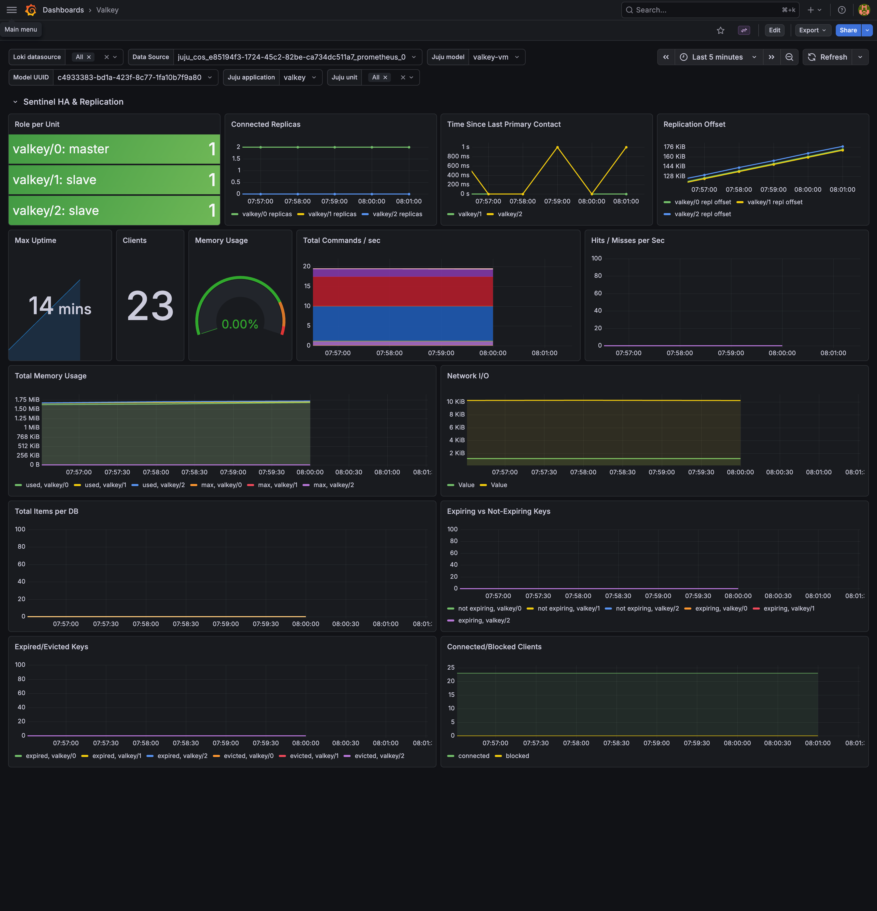
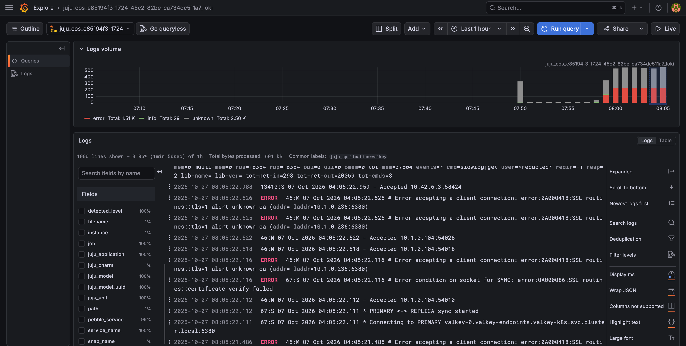

(how-to-monitoring)=

# How to enable monitoring

This guide provides instructions for integrating Charmed Valkey with the
[Canonical Observability Stack (COS)](https://documentation.ubuntu.com/observability/).
After you integrate the two, COS receives:

- metrics from a [Redis exporter](https://github.com/oliver006/redis_exporter) that runs next to
  each Valkey unit
- the Valkey and Sentinel logs
- a Grafana dashboard and the [alert rules](reference-alert-rules) that ship with the
  charm

## Prerequisites

- You have deployed Charmed Valkey. See [How to deploy](how-to-deploy).
- You have deployed COS Lite in a Kubernetes model. See
  [Deploy COS Lite using Terraform](https://documentation.ubuntu.com/observability/latest/tutorial/cos-lite-canonical-k8s-sandbox/#deploy-cos-lite-using-terraform).

```{note}
The [Best practice](https://documentation.ubuntu.com/observability/track-3.0/reference/topology/#deploy-in-isolation) is using a dedicated model for COS deployment.
```

This guide uses the following placeholders:

- `<cos_controller>` is the Kubernetes controller that hosts COS
- `<cos_model>` is the model where COS (or COS Lite) runs
- `<valkey_controller>` is the controller that hosts Charmed Valkey
- `<valkey_model>` is the model where Charmed Valkey runs
- `valkey` is the name of the Charmed Valkey application. Replace it if you deployed it under
  another name.

## Connection options

You can connect Charmed Valkey to COS in two ways:

- [Separate models](how-to-monitoring-separate-models) (recommended): COS runs in its own model.
  Offers connect the two models and an OpenTelemetry Collector sends the data to COS.
- [Same model](how-to-monitoring-same-model): Charmed Valkey runs on Kubernetes in the same model
  as COS. You integrate the COS applications with Charmed Valkey directly.

(how-to-monitoring-separate-models)=

## Separate models

### Offer the COS endpoints

The COS Lite Terraform module creates the offers below for you. If you deployed COS Lite another
way, create them from the COS model:

```shell
juju switch <cos_controller>:<cos_model>
juju offer grafana:grafana-dashboard grafana-dashboards
juju offer loki:logging loki-logging
juju offer prometheus:receive-remote-write prometheus-receive-remote-write
```

### Consume the offers

Switch to the Charmed Valkey model and consume the offers:

```shell
juju switch <valkey_controller>:<valkey_model>
juju consume <cos_controller>:admin/<cos_model>.grafana-dashboards
juju consume <cos_controller>:admin/<cos_model>.loki-logging
juju consume <cos_controller>:admin/<cos_model>.prometheus-receive-remote-write
```

These URLs assume that the `admin` user owns the COS model. To list the exact URLs, run
`juju find-offers <cos_controller>:`.

### Deploy the OpenTelemetry Collector

The OpenTelemetry Collector reads metrics, logs, dashboards and alert rules from Charmed Valkey and
sends them to COS.

`````{tab-set}
:sync-group: substrate

````{tab-item} VM
:sync: vm

The [`opentelemetry-collector`](https://charmhub.io/opentelemetry-collector) charm runs as a
subordinate on each Valkey machine. It gets its data from Charmed Valkey over the `cos-agent`
endpoint.

Deploy the collector and integrate it with Charmed Valkey:

```shell
juju deploy opentelemetry-collector --channel 0.130/stable --base ubuntu@26.04
juju integrate valkey:cos-agent opentelemetry-collector
```

Integrate the collector with the consumed offers:

```shell
juju integrate opentelemetry-collector:send-remote-write prometheus-receive-remote-write
juju integrate opentelemetry-collector:send-loki-logs loki-logging
juju integrate opentelemetry-collector:grafana-dashboards-provider grafana-dashboards
```

The collector pushes data to the addresses that COS advertises through its ingress, so each Valkey
machine must reach those addresses.

````

````{tab-item} K8s
:sync: k8s

The [`opentelemetry-collector-k8s`](https://charmhub.io/opentelemetry-collector-k8s) charm runs as
its own application in the Valkey model. Charmed Valkey uses three endpoints: `metrics-endpoint`,
`grafana-dashboard` and `logging`.

Deploy the collector and integrate it with Charmed Valkey:

```shell
juju deploy opentelemetry-collector-k8s --channel 0.130/stable --trust
juju integrate valkey:metrics-endpoint opentelemetry-collector-k8s:metrics-endpoint
juju integrate valkey:grafana-dashboard opentelemetry-collector-k8s:grafana-dashboards-consumer
juju integrate valkey:logging opentelemetry-collector-k8s:receive-loki-logs
```

Integrate the collector with the consumed offers:

```shell
juju integrate opentelemetry-collector-k8s:send-remote-write prometheus-receive-remote-write
juju integrate opentelemetry-collector-k8s:send-loki-logs loki-logging
juju integrate opentelemetry-collector-k8s:grafana-dashboards-provider grafana-dashboards
```

The collector pushes data to the addresses that COS advertises through its ingress, so the
Kubernetes cluster that runs the collector must reach those addresses.

````

`````

If COS serves its ingress over TLS, integrate the collector's `receive-ca-cert` endpoint with the
charm that provides the ingress CA.

Check both models and wait until every application is `active` and `idle`:

```shell
juju status -m <valkey_controller>:<valkey_model>
juju status -m <cos_controller>:<cos_model>
```

The Charmed Valkey model then looks like this:

`````{tab-set}
:sync-group: substrate

````{tab-item} VM
:sync: vm

```text
Model      Controller  Cloud/Region         Version  SLA          Timestamp
valkey-vm  lxd         localhost/localhost  3.6.28   unsupported  07:50:15+04:00

SAAS                             Status  Store  URL
grafana-dashboards               active  k8s    admin/cos.grafana-dashboards
loki-logging                     active  k8s    admin/cos.loki-logging
prometheus-receive-remote-write  active  k8s    admin/cos.prometheus-receive-remote-write

App                      Version  Status  Scale  Charm                    Channel       Rev  Exposed  Message
opentelemetry-collector  0.130.0  active      3  opentelemetry-collector  0.130/stable  561  no
valkey                            active      3  valkey                   9/edge        115  no

Unit                          Workload  Agent  Machine  Public address  Ports                      Message
valkey/0*                     active    idle   0        10.42.6.156     6379-6380,26379-26380/tcp
  opentelemetry-collector/2   active    idle            10.42.6.156
valkey/1                      active    idle   1        10.42.6.3       6379-6380,26379-26380/tcp
  opentelemetry-collector/0*  active    idle            10.42.6.3
valkey/2                      active    idle   2        10.42.6.151     6379-6380,26379-26380/tcp
  opentelemetry-collector/3   active    idle            10.42.6.151

Machine  State    Address      Inst id        Base          AZ   Message
0        started  10.42.6.156  juju-7f9a80-0  ubuntu@26.04  xof  Running
1        started  10.42.6.3    juju-7f9a80-1  ubuntu@26.04  xof  Running
2        started  10.42.6.151  juju-7f9a80-2  ubuntu@26.04  xof  Running
```

````

````{tab-item} K8s
:sync: k8s

```text
Model       Controller  Cloud/Region     Version  SLA          Timestamp
valkey-k8s  lxd         k8s-lxd/default  3.6.28   unsupported  08:09:05+04:00

SAAS                             Status  Store  URL
grafana-dashboards               active  k8s    admin/cos.grafana-dashboards
loki-logging                     active  k8s    admin/cos.loki-logging
prometheus-receive-remote-write  active  k8s    admin/cos.prometheus-receive-remote-write

App                          Version  Status  Scale  Charm                        Channel       Rev  Address        Exposed  Message
opentelemetry-collector-k8s  0.130.1  active      1  opentelemetry-collector-k8s  0.130/stable  272  10.152.183.88  no
valkey                                active      3  valkey                       9/edge        115  10.152.183.85  no

Unit                            Workload  Agent  Address     Ports  Message
opentelemetry-collector-k8s/0*  active    idle   10.1.0.2
valkey/0*                       active    idle   10.1.0.236
valkey/1                        active    idle   10.1.0.104
valkey/2                        active    idle   10.1.0.204
```

````

`````

(how-to-monitoring-same-model)=

## Same model

```{note}
Use this method only if Charmed Valkey runs on Kubernetes in the same model as COS. Otherwise, use
[separate models](how-to-monitoring-separate-models).
```

In this setup you do not need the offers or the collector. Integrate the COS applications with
Charmed Valkey directly:

```shell
juju switch <cos_controller>:<cos_model>
juju integrate valkey:metrics-endpoint prometheus
juju integrate valkey:grafana-dashboard grafana
juju integrate valkey:logging loki
```

Next, follow the steps in [Open the Valkey dashboard](how-to-monitoring-dashboard). For the
remainder of this guide, replace `<valkey_model>` with `<cos_model>`.

(how-to-monitoring-dashboard)=

## Open the Valkey dashboard

Get the Grafana URL and the admin password:

```shell
juju run grafana/leader get-admin-password --model <cos_controller>:<cos_model>
```

The output looks like this:

```text
admin-password: <password>
url: http://<cos_ingress_address>/<cos_model>-grafana
```

Open the URL and log in as `admin` with that password. Go to **Dashboards** and open the
**Valkey** dashboard.



## View logs

Loki receives the Valkey and Sentinel logs. To read them, open **Explore** in
Grafana, pick the Loki data source and filter on `juju_application="valkey"`.



Each unit also keeps the log files on disk:

`````{tab-set}
:sync-group: substrate

````{tab-item} VM
:sync: vm

`valkey.log` and `sentinel.log` are in `/var/snap/valkey-charmed/common/var/log/valkey/`. The
directory belongs to `snap_daemon`, so list it with `sudo`:

```shell
juju ssh valkey/0 sudo ls -l /var/snap/valkey-charmed/common/var/log/valkey/
```

The output looks like this:

```text
total 32
-rw-r--r-- 1 snap_daemon snap_daemon  1683 Oct  7 03:46 sentinel.log
-rw-r--r-- 1 snap_daemon snap_daemon 23722 Oct  7 04:13 valkey.log
```

````

````{tab-item} K8s
:sync: k8s

`valkey.log` and `sentinel.log` are in `/var/log/valkey/` in the `valkey` container:

```shell
juju ssh --container valkey valkey/0 ls -l /var/log/valkey/
```

The output looks like this:

```text
total 616
drwxrws--- 2 root     170  16384 Oct  7 03:55 lost+found
-rw-r--r-- 1 _daemon_ 170    743 Oct  7 03:57 sentinel.log
-rw-r--r-- 1 _daemon_ 170 602834 Oct  7 04:14 valkey.log
```

````

`````

## Query the metrics endpoint

The exporter serves metrics on port `9121` at `/metrics`. It connects to Valkey over TLS as the
`charmed-stats` user, which can run only the commands the exporter needs. Metric names start with
`redis_`, the exporter's prefix. The
[exporter documentation](https://github.com/oliver006/redis_exporter) lists them.

`````{tab-set}
:sync-group: substrate

````{tab-item} VM
:sync: vm

The exporter listens on `127.0.0.1` only, so only the collector on the same machine can scrape it.
To read the metrics yourself, run `curl` on the unit:

```shell
juju ssh valkey/0 curl -s http://127.0.0.1:9121/metrics
```

````

````{tab-item} K8s
:sync: k8s

The exporter listens on all interfaces of the pod. To read the metrics from your machine, forward
the port and run `curl`. The Kubernetes namespace has the same name as the Juju model:

```shell
kubectl -n <valkey_model> port-forward pod/valkey-0 9121:9121
curl -s http://127.0.0.1:9121/metrics
```

````

`````

The output has several hundred lines. On the primary, part of it looks like this:

```text
# HELP redis_up Information about the Redis instance
# TYPE redis_up gauge
redis_up{instance_role="master"} 1
# HELP redis_connected_slaves connected_slaves metric
# TYPE redis_connected_slaves gauge
redis_connected_slaves{instance_role="master"} 2
# HELP redis_connected_clients connected_clients metric
# TYPE redis_connected_clients gauge
redis_connected_clients{instance_role="master"} 7
# HELP redis_memory_used_bytes memory_used_bytes metric
# TYPE redis_memory_used_bytes gauge
redis_memory_used_bytes{instance_role="master"} 1.92476e+06
```

`redis_up` is `1` when the exporter reaches Valkey and `0` when it does not.

## Next steps

For the alerts that Charmed Valkey ships, see [Alert rules](reference-alert-rules).
