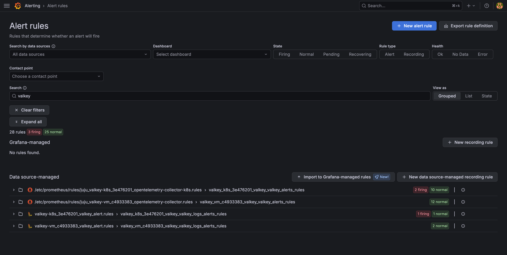

(reference-alert-rules)=

# Alert rules

Charmed Valkey ships Prometheus and Loki alert rules. When you [enable monitoring](how-to-monitoring), Prometheus
and Loki load the rules and send the alerts that fire to Alertmanager. To send alerts to email, Slack
or another receiver, see
[Integrate Alertmanager receivers](https://documentation.ubuntu.com/observability/latest/how-to/integrate/integrate-alertmanager-receivers/).
To change or add rules, see
[Customize alert rules](https://documentation.ubuntu.com/observability/latest/how-to/configure-and-tune/customize-alert-rules/).

To see the rules and their state, open **Alerting > Alert rules** in Grafana and search for
`valkey`. Each Charmed Valkey model has one Prometheus group and one Loki group:

## Prometheus rules

| Alert                            | Severity | Fires when                                                                                                                 |
| -------------------------------- | -------- | -------------------------------------------------------------------------------------------------------------------------- |
| `ValkeyDown`                     | critical | The exporter cannot reach Valkey on a unit for 1 minute.                                                                   |
| `ValkeyMissingPrimary`           | critical | No unit reports the primary role for 1 minute.                                                                             |
| `ValkeyTooManyPrimaries`         | critical | More than one unit reports the primary role for 1 minute, which means a split brain.                                       |
| `ValkeyDisconnectedReplicas`     | critical | For 2 minutes, the primary has fewer connected replicas than there are other running Valkey units.                         |
| `ValkeyPrimaryLinkDown`          | critical | A replica has lost its link to the primary for 2 minutes.                                                                  |
| `ValkeyRDBSaveFailed`            | critical | The last background RDB save failed. Valkey rejects writes until a save succeeds.                                          |
| `ValkeyAOFWriteFailed`           | critical | The last append-only file write failed.                                                                                    |
| `ValkeyAOFRewriteFailed`         | critical | The last append-only file rewrite failed.                                                                                  |
| `ValkeyClusterFlapping`          | critical | For 2 minutes, the number of connected replicas changes more than once a minute.                                           |
| `ValkeyOutOfSystemMemory`        | warning  | Valkey uses more than 90% of the system memory for 2 minutes. On Kubernetes, this is the node's memory, not the pod limit. |
| `ValkeyOutOfConfiguredMaxmemory` | warning  | Valkey uses more than 90% of its `maxmemory` limit for 2 minutes.                                                          |
| `ValkeyTooManyConnections`       | warning  | Connected clients exceed 90% of `maxclients` for 2 minutes.                                                                |

## Loki rules

| Alert                               | Severity | Fires when                                                                                   |
| ----------------------------------- | -------- | -------------------------------------------------------------------------------------------- |
| `ValkeyOutOfMemoryAllocationFailed` | critical | Valkey logs `Out Of Memory allocating` and aborts. A kernel OOM kill does not log this line. |
| `ValkeySentinelFailoverAborted`     | warning  | Sentinel logs a `-failover-abort-*` event during a failover.                                 |
